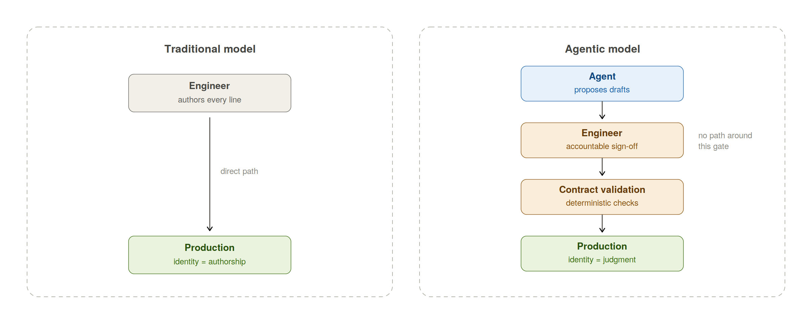
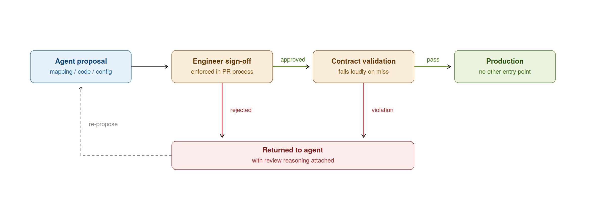
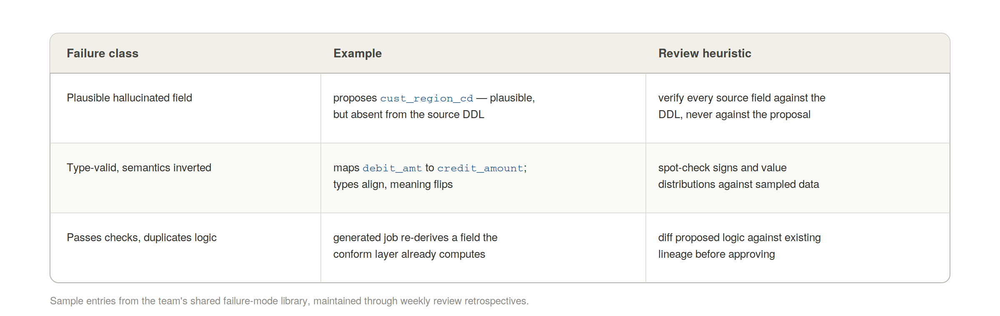

# Your Engineers Aren't Afraid of AI. They're Afraid of Being Reviewers.

*Part 3 of the series "Production Agentic Engineering" — [series index](#)*

*In the traditional model, identity rests on authorship. In the agentic model, it rests on judgment — and the gate is not optional.*

The two companion retrospectives in this series cover the technical side of running a production agentic engineering organization at a major financial institution — the governance model that made it safe, and the schema mapping workflow that made it pay. This one covers the part that nearly determined whether any of it stuck: the human transition. It was harder than every technical problem combined, and it is the part I see other organizations underestimating most.

## The Real Fear, Stated Precisely

The industry narrative says engineers resist AI because they fear replacement. On a 25-person team over more than a year, I did not find that fear to be the operative one. Engineers are rational about capability; most could see the tools were not going to replace someone who understood the platform, the data, and the business.

The operative fear was quieter and more legitimate: the fear of becoming a reviewer.

An engineer's professional identity is built on authorship. You wrote the pipeline. You understood every line because you produced every line. Your sense of craft, your defensibility in an incident review, your standing with your peers — all of it rests on authorship. The agentic model asks engineers to give that up: the agent produces the first draft, and the engineer's job becomes judgment — specifying, reviewing, correcting, approving, and owning the result.

For some engineers that reads as promotion to editor-in-chief. For others it reads as demotion to rubber stamp. Both reactions were present on day one, and which one spread was not left to chance.

## What "Reviewer" Must Mean for This to Work

The transition fails when review is procedural — a checkbox after the agent has done "the real work." It succeeds when review is structural: the engineer is the accountable author of record, with the agent as a fast, thorough junior analyst whose output has no path to production except through the engineer's judgment.

We made that structural, not aspirational, with three mechanisms already described in the governance retrospective — engineer sign-off enforced in the PR process, contract validation that failed loudly on anything review missed, and rules files that constrained what agents could produce in the first place. The point of repeating them here is their organizational function: those mechanisms are what made "reviewer" a position of authority rather than a courtesy role. An engineer whose approval is load-bearing is an author. An engineer whose approval is ceremonial is a bystander, and bystanders disengage.

*The gate is structural: rejected proposals return to the agent with reasoning attached — there is no path around sign-off.*

## What We Actually Did

**Pair sessions, senior engineer plus agent, live.** Not training videos, not a prompt-engineering wiki. A senior engineer worked a real task — a schema mapping, a Glue job scaffold — with the agent, in front of the team, including the failures. The team watched proposals get rejected, watched the engineer interrogate a low-confidence mapping, watched the agent be genuinely wrong and get caught by the contract check. Seeing the agent fail safely did more for adoption than seeing it succeed. It demonstrated that the governance layer was real and that judgment was still the scarce skill in the room.

**A shared library of failure modes, built in weekly retrospectives.** Every week the team logged what the agents got wrong: hallucinated fields that were plausible but absent from the source, mappings that satisfied types but inverted semantics, generated code that passed checks while quietly duplicating logic. Cataloguing failures did two jobs. It made review sharper — engineers knew what class of error to hunt for. And it professionalized skepticism: finding agent errors became a visible, valued contribution rather than resistance to the program.

*Sample entries from the team's shared failure-mode library. Field names are representative, not client data.*

**No agent output without sign-off — including mine.** The rule had no exceptions by seniority or urgency. The first time a deadline pressured someone to shortcut review, the shortcut would have become the norm; the rule holding under pressure is what made it a rule.

**Letting the workload argue for us.** We sequenced the rollout so the first agentic workflow was schema mapping — the least loved work on the team, detailed in the companion retrospective. Nobody's identity was invested in manual schema archaeology. Removing it created advocates; the advocates carried the harder conversations about code generation later. Sequencing is an underrated adoption tool: start where the work is hated, not where the demo is impressive.

## What Changed, Honestly Reported

The team's engagement shifted from neutral-to-negative to strongly positive over the transition — measured through our regular engagement surveys, though I hold soft metrics like that loosely and suggest you do the same. The harder evidence was behavioral: engineers began proposing new agentic workflows unprompted, the failure-mode library became self-sustaining without me chairing it, and attrition on the team during a disruptive re-platforming was zero.

Not everyone converted at the same rate, and honesty requires saying that a small number never fully did. The engineers who struggled most were not the least skilled — some were among the strongest, precisely because authorship was most central to how they understood their own value. What worked with them was not evangelism but scope: giving them ownership of the governance layer itself — the contracts, the validation logic, the rules files. The deterministic infrastructure that constrains the agents is authored, in the fullest traditional sense, by humans. That is where craft-identity engineers thrive in this model, and framing it that way early would have saved months.

## The Leadership Obligation

A closing observation for engineering leaders considering this transition. The velocity gains are real and the tooling is now abundant. But the tooling vendors are selling you the agent, and the agent is the easy part. What you are actually deciding to manage is an identity transition for every senior person on your team — and identity transitions are led, not announced. If you are not prepared to be in the pair sessions, hold the sign-off rule against your own deadlines, and re-scope roles for the engineers whose craft the model displaces, the program will produce impressive demos and quiet attrition. The organizations that get this right will not be the ones with the best agents. They will be the ones whose engineers wanted to stay through the change.

---

**In this series:**

1. Governance Before Velocity: What Actually Made Agentic Engineering Work in Production
2. The Highest-ROI Agentic Use Case Nobody Talks About: Schema Mapping
3. Your Engineers Aren't Afraid of AI. They're Afraid of Being Reviewers. *(this piece)*
4. *Forthcoming*

*Originally published and maintained at [Substack Link Placeholder]. Source files available at [GitHub Repo Placeholder].*
